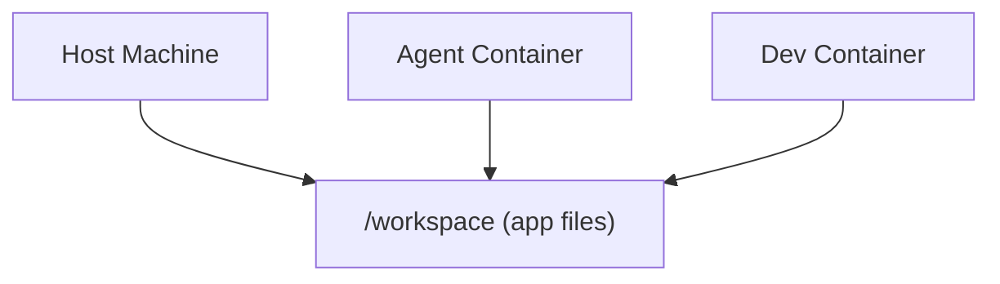

# AgentIncus (Experimental)

AgentIncus, inspired by [Code in Incus (COI)](https://github.com/mensfeld/code-on-incus), is a set of shell scripts that automate the creation of [Incus](https://linuxcontainers.org/incus/) containers for AI agents and secure development. See COI's [Why Incus](https://github.com/mensfeld/code-on-incus?tab=readme-ov-file#why-incus-over-docker) for why Incus over Docker.

Why shell scripts? They introduce no dependencies, are ergonomic enough for simple systems administration tasks, and transparently convey their purpose. They're meant to be copied and tailored to your needs.

## Contents

- [Prerequisites](#prerequisites)
- [Install](#install)
- [Quick Start](#quick-start)
- [Scripts](#scripts)
- [incus.init Options](#incusinit-options)
  - [What incus.init does](#what-incusinit-does)
  - [Optional Components](#optional-components)
- [The Development Workflow](#the-development-workflow)
  - [Base Images](#base-images)
  - [Expose Container Ports](#expose-container-ports)
  - [Snapshots](#snapshots)
- [Runtime Management](#runtime-management)
- [Linux Gotchas](#linux-gotchas)

## Prerequisites

- **Linux**: [Incus](https://linuxcontainers.org/incus/docs/main/installing/) installed and initialized (`incus admin init`)
- **macOS**: [Homebrew](https://brew.sh/) installed — `incus.init` will automatically prompt to install Colima and the Incus CLI, then bootstrap a Colima VM with the Incus runtime
- `~/.local/bin` in your `PATH`

## Install

```bash
git clone <repo-url> agent_incus
cd agent_incus
./install_shortcuts
```

This symlinks the helper scripts into `~/.local/bin`.

## Quick Start

```bash
# Create a container with the current directory mounted as /workspace
inci my-project

# Open a shell
incs my-project

# Run a command (e.g. Claude Code)
incs my-project claude
```

## Scripts

| Script | Alias | Purpose |
|---|---|---|
| `incs` | — | Unified CLI (shell, init, network, update) |
| `incus.init` | `inci` | Create and provision a container |
| `incus.shell` | — | Open a login shell (or run a command) in a container |
| `incus.network` | `incn` | Manage port proxy devices |
| `incus.macos.setup` | — | Bootstrap Colima + Incus on macOS (called automatically by `incus.init`) |
| `install_shortcuts` | — | Symlink helpers and aliases into `~/.local/bin` |

### incs — Unified CLI

`incs` is the main entrypoint. It routes to the underlying scripts:

```bash
incs my-project                        # Shell into container (default)
incs -s my-project                     # Shell (explicit)
incs -s my-project mix test            # Run a command in container
incs -i my-project                     # Create a new container
incs -i my-project --from base-dev     # Create from template
incs -n my-project 4000 3241           # Proxy ports 4000 and 3241 to localhost
incs -n my-project -b 10.0.0.5 4000   # Proxy on a specific address (e.g. Tailscale IP for remote access)
incs -n my-project -l                  # List active proxies
incs -n my-project -r 4000            # Remove proxy for port 4000
incs -n my-project -r all             # Remove all proxies
incs -u my-project                     # Update packages in a container
incs -ua                               # Update all agent-incus containers
incs cron install                      # Install 7pm daily update cron
incs cron install 3                    # Install 3am daily update cron
incs cron status                       # Show current cron schedule
incs cron remove                       # Remove the update cron
```

The individual scripts and aliases (`inci`, `incn`) still work directly.

## incus.init Options

```
Usage: incus.init [OPTIONS] <container-name>

Options:
  -p, --path PATH           Host directory to mount (default: current directory)
  -m, --mount-path PATH     Container mount point (default: /workspace)
  -f, --from TEMPLATE       Launch from a saved template (shorthand for --image incus-init/TEMPLATE)
  -i, --image IMAGE         Base image override (default: ubuntu/24.04)
  -t, --template            Save container as a reusable local template (implies --no-mount)
  --1pass                   Install 1Password CLI (prompts for service account token)
  --gh-token                Configure GitHub auth (prompts for PAT, sets up gh CLI)
  --entire                  Install Entire CLI (https://github.com/entireio/cli)
  --no-mount                Clone repo into container instead of mounting host directory
  --no-sudo                 Do not grant sudo to the container user (for AI agents)
  --colima-cpus N           Colima VM CPUs (default: 4, macOS only)
  --colima-memory N         Colima VM memory in GB (default: 8, macOS only)
  --colima-disk N           Colima VM disk in GB (default: 100, macOS only)
  --dry-run                 Show what would be done without doing it
```

### What incus.init does

1. Launches an Ubuntu 24.04 container (override with `--image`)
3. Installs build tools, dev libraries, Python, and Node.js
4. Creates a user matching your host UID/GID with passwordless sudo
5. Mounts your host directory into the container (tries `shift=true`, falls back to `raw.idmap`)
6. Installs [mise](https://mise.jdx.dev/) (runtime version manager) and [Oh My Zsh](https://ohmyz.sh/)
7. Presents an interactive TUI to select optional components (see below)

### Default Packages

Every container is provisioned with the following packages before any optional components are selected:

| Category | Packages |
|---|---|
| Core | bash, curl, git, wget, sudo, unzip, tmux, zsh |
| Build tools | build-essential, pkg-config, autoconf, automake, bison, cmake |
| Dev libraries | libssl-dev, libreadline-dev, libyaml-dev, libsqlite3-dev, libffi-dev, libncurses-dev, zlib1g-dev, and more |
| Runtimes | python3, python3-dev, python3-pip, python3-venv, nodejs, npm |
| Utilities | gpg, ca-certificates, psmisc, fontconfig, fzf, bat |
| Tools | [mise](https://mise.jdx.dev/) (runtime version manager), [Oh My Zsh](https://ohmyz.sh/) (with zsh-autosuggestions), [GitHub CLI](https://cli.github.com/) |

### Optional Components

The TUI lets you pick from the following optional packages during container creation:

| Component | Description |
|---|---|
| [Docker](https://www.docker.com/) | Container runtime & compose (enabled by default) |
| [Chromium / Playwright](https://playwright.dev/) | Headless browser for testing |
| [OpenSpec](https://github.com/Fission-AI/OpenSpec) | Spec-driven development CLI |
| [rtk](https://github.com/rtk-ai/rtk) | High-performance CLI proxy that reduces LLM token consumption by 60-90% |
| [fzf](https://github.com/junegunn/fzf) + [bat](https://github.com/sharkdp/bat) | Interactive search & file preview |
| [Claude Code](https://docs.anthropic.com/en/docs/claude-code) | AI coding assistant |
| [1Password CLI](https://developer.1password.com/docs/cli/) | Password manager CLI |
| [GitHub Auth](https://cli.github.com/) | GitHub token & git credentials |
| [just](https://github.com/casey/just) | Command runner for project tasks |
| [Entire CLI](https://github.com/entireio/cli) | Entire CLI tool |
| [Glow](https://github.com/charmbracelet/glow) | Terminal markdown viewer |
| [Codex](https://github.com/openai/codex) | OpenAI coding agent |

Skip the TUI with `--no-tui` to use defaults, or pre-select components via CLI flags (`--1pass`, `--gh-token`, `--entire`).

## The Development Workflow

A recommended setup uses two containers sharing the same workspace. The agent container runs with `--no-sudo` so AI tools cannot escalate privileges, while the dev container has full access and credentials:



```bash
# Agent container — no sudo, no credentials
inci --no-sudo project-agent

# Dev container — with credentials
inci --1pass --gh-token project-dev

# Save as reusable template, then spin up new containers instantly
inci --template project-base
inci --from project-base --no-sudo project-agent-2
```

The host, agent, and dev containers all read and write the same `/workspace` directory. Your editor, the AI agent, and your dev tools all see the same files.

### Templates

Provisioning a container from scratch installs packages, build tools, mise, Oh My Zsh, and Docker. This takes a few minutes. You can skip that on subsequent containers by saving a **template** — a snapshot of a fully provisioned container with no secrets baked in, stored in the local Incus image store.

**Build once:**

```bash
inci --template my-base
```

This provisions the container (without mounting host files), scrubs any tokens, and saves it locally as `incus-init/my-base`. The original container keeps running with its tokens intact.

**Reuse instantly:**

```bash
# Spin up a new container from the base image — seconds, not minutes
inci --from my-base my-project

# Same base, different credentials
inci --from my-base --1pass --gh-token my-dev
```

When launching from a template, provisioning (packages, shell setup, Oh My Zsh) is skipped entirely. Only workspace mounting, user creation (if needed), and selected components run.

**Manage templates:**

```bash
incus image list             # see saved templates
incus image delete incus-init/my-base  # remove one
```


### Expose Container Ports

To access a service running inside a container from your host:

```bash
# Proxy one or more ports to localhost
incs -n project-dev 4000 3241

# Proxy to a specific address (e.g. Tailscale IP)
incs -n project-dev -b 100.69.177.88 4000

# List active proxies
incs -n project-dev -l

# Remove a proxy
incs -n project-dev -r 4000
```

Or use the container/VM IP directly — find it with `incus list` (Linux) or `colima list` (macOS). On macOS, the Colima VM IP (e.g. `192.168.64.6`) is a private address only accessible from your Mac.

**Important: bind to 0.0.0.0** — most dev servers bind to `localhost` by default, which blocks access from outside the container. You need to bind to all interfaces:

```bash
# Astro
npm run dev -- --host 0.0.0.0

# Next.js
npm run dev -- -H 0.0.0.0

# Rails
bin/rails server -b 0.0.0.0

# Phoenix
mix phx.server  # binds 0.0.0.0 by default, but check config/dev.exs for ip: {127, 0, 0, 1}

# FastAPI
uvicorn main:app --host 0.0.0.0

# Vite (Vue, Svelte, etc.)
npm run dev -- --host 0.0.0.0
```

### Updating Containers

Containers don't have sudo by default, so package updates run from the host via `incus exec`:

```bash
# Update a single container
incs -u my-project

# Update all agent-incus managed containers
incs -ua
```

`incs -ua` starts stopped containers, updates them, then stops them again. Containers that were already running are left running. Only containers tagged with `user.managed-by=agent-incus` (set automatically during `inci`) are updated. Non-Debian containers are skipped.

Logs are written to `/var/log/incs/` and cleaned up on success.

#### Scheduled Updates

Install a daily cron to update all containers automatically:

```bash
incs cron install         # Daily at 7pm (default)
incs cron install 3       # Daily at 3am
incs cron status          # Show current schedule
incs cron remove          # Remove the cron
```

#### Failure Notifications

If an update fails, you'll see a notification the next time you open a terminal:

```
⚠️  incs update failed (2026-04-11 19:00): avex mix-claude
   Run 'ls /var/log/incs/' to see logs
```

To enable this, add the notification hook to your shell:

```bash
incs notify-snippet >> ~/.zshrc
```

### Snapshots

Capture environment state for rollback:

```bash
incus snapshot project-dev before-refactor
incus restore project-dev before-refactor
incus info project-dev   # list snapshots
```

## Runtime Management

Containers come with [mise](https://mise.jdx.dev/) pre-installed. Install runtimes per-project:

```bash
cd /workspace
mise use python@3.12 node@20
```

Or add a `mise.toml` to your project — `incus.init` runs `mise install` automatically if one exists.

## Linux Gotchas

### Firewall (UFW)

If UFW is enabled on the host, its default DROP policy will block traffic on the Incus bridge. See the [Incus firewall documentation](https://linuxcontainers.org/incus/docs/main/howto/network_bridge_firewalld/#ufw-add-rules-for-the-bridge) for setup instructions. The things you'll need to allow:

- **DHCP + DNS** — containers need these to get an IP address and resolve names
- **Outbound forwarding** — containers need a route through the host to reach the internet. Optionally, if you use `--proxy`, the proxy port on the host must also accept connections from the bridge

### IPv6

If your host doesn't have IPv6 internet, [disable it on the bridge](https://linuxcontainers.org/incus/docs/main/reference/network_bridge/):

```bash
incus network set incusbr0 ipv6.address none
```

Without this, containers get an IPv6 address from Incus and prefer it (per RFC 6724). The symptom is confusing: `ping` works (resolves to IPv4) but `apt-get update` hangs trying to reach mirrors over IPv6.
