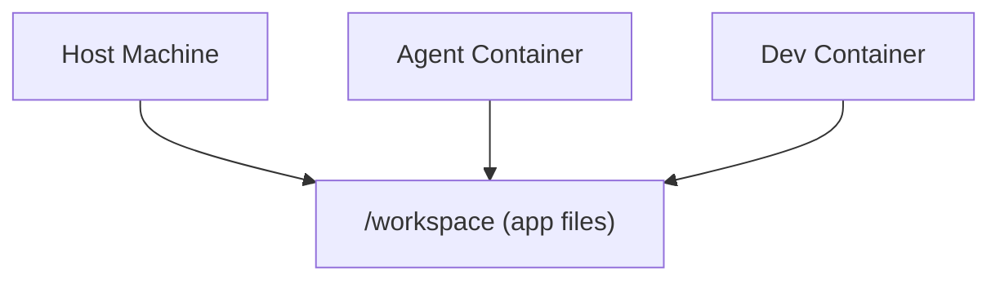
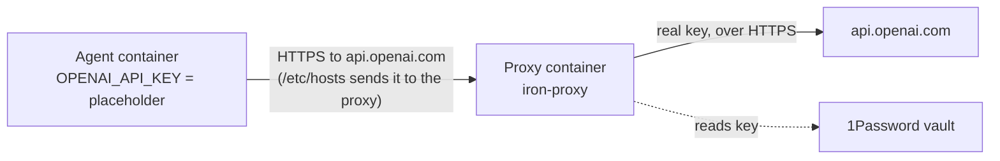

# AgentIncus

A set of shell scripts that automate the creation of [Incus](https://linuxcontainers.org/incus/) containers for AI agents and secure development. See COI's [Why Incus](https://github.com/mensfeld/code-on-incus?tab=readme-ov-file#why-incus-over-docker) for why Incus over Docker.

Why shell scripts? They introduce no dependencies, are ergonomic enough for simple systems administration tasks, and transparently convey their purpose.

## Contents

- [Prerequisites](#prerequisites)
- [Install](#install)
- [Quick Start](#quick-start)
- [Scripts](#scripts)
- [incus.init Options](#incusinit-options)
  - [What incus.init does](#what-incusinit-does)
  - [Optional Plugins](#optional-plugins)
- [The Development Workflow](#the-development-workflow)
  - [Git on a shared workspace](#git-on-a-shared-workspace)
  - [Templates](#templates)
  - [Virtual Machines](#virtual-machines)
  - [Tailscale](#tailscale)
  - [Credential Proxy](#credential-proxy)
  - [Expose Container Ports](#expose-container-ports)
  - [Snapshots](#snapshots)
- [Runtime Management](#runtime-management)
- [Linux Gotchas](#linux-gotchas)

## Prerequisites

- **Linux**: [Incus](https://linuxcontainers.org/incus/docs/main/installing/) installed and initialized (`incus admin init`)
- **macOS**: [Homebrew](https://brew.sh/) installed — `incus.init` will automatically prompt to install Colima and the Incus CLI, then bootstrap a Colima VM with the Incus runtime
- `~/.local/bin` in your `PATH`

## Install

```bash
git clone <repo-url> agent_incus
cd agent_incus
./install_shortcuts
```

This symlinks the helper scripts into `~/.local/bin`.

## Quick Start

```bash
# Create a container with the current directory mounted as /workspace
incs -i my-project

# Open a shell
incs my-project

# Run a command (e.g. Claude Code)
incs my-project claude
```

## Scripts

| Script | Alias | Purpose |
|---|---|---|
| `incs` | — | Unified CLI (shell, init, network, update) |
| `incus.init` | `inci` | Create and provision a container |
| `incus.shell` | — | Open a login shell (or run a command) in a container |
| `incus.network` | `incn` | Manage port proxy devices |
| `incus.proxy` | — | Credential proxies: keep real tokens out of containers (`incs proxy`) |
| `incus.macos.setup` | — | Bootstrap Colima + Incus on macOS (called automatically by `incus.init`) |
| `incs.new-plugin` | — | Scaffold a new plugin file from a template (also `incs new-plugin`) |
| `install_shortcuts` | — | Symlink helpers and aliases into `~/.local/bin` |

### incs — Unified CLI

`incs` is the main entrypoint. It routes to the underlying scripts:

```bash
incs my-project                        # Shell into container (default)
incs -s my-project                     # Shell (explicit)
incs -s my-project mix test            # Run a command in container
incs -i my-project                     # Create a new container
incs -i my-project --from base-dev     # Create from template
incs -n my-project 4000 3241           # Proxy ports 4000 and 3241 to localhost
incs -n my-project 4000:8080           # Host 4000 -> container 8080
incs -n my-project -b 10.0.0.5 4000   # Proxy on a specific address (e.g. Tailscale IP for remote access)
incs -n my-project -l                  # List active proxies
incs -n my-project -r 4000            # Remove proxy for port 4000
incs -n my-project -r all             # Remove all proxies
incs -u my-project                     # Update packages in a container
incs -ua                               # Update all agent-incus containers
incs -d my-project                     # Delete a container and its owned proxy
incs -i scratch --no-proxy             # Create a container without a proxy
incs proxy add my-project --token      # Add GitHub access through its default proxy
incs proxy add my-project --env OPENAI_API_KEY --host api.openai.com   # Any header-key API
incs proxy apply my-project services.yaml   # Attach every service listed in a file
incs proxy configure my-project-proxy  # Read keys from 1Password
incs proxy rm my-project               # Detach services from a container
incs proxy list                        # Show proxies and attached containers
incs cron install                      # Install 7pm daily update cron
incs cron install 3                    # Install 3am daily update cron
incs cron status                       # Show current cron schedule
incs cron remove                       # Remove the update cron
```

The individual scripts and aliases (`inci`, `incn`) still work directly.

## incus.init Options

```
Usage: incus.init [OPTIONS] <container-name>

Options:
  -p, --path PATH           Host directory to mount (default: current directory)
  -m, --mount-path PATH     Container mount point (default: /workspace)
  -f, --from TEMPLATE       Launch from a saved template (shorthand for --image incus-init/TEMPLATE)
  -i, --image IMAGE         Base image override (default: ubuntu/24.04)
  -t, --template            Save container as a reusable local template (implies --no-mount)
  --<plugin>                Pre-select a plugin (e.g. --1pass, --gh-token)
  --no-mount                Clone repo into container instead of mounting host directory
  --git-rw                  Let the container write .git/config and .git/hooks
                            (default: read-only, so it cannot plant commands the host's git runs)
  --vm                      Provision a KVM virtual machine instead of a container
  --no-copy                 VM only: start with an empty (sealed) workspace
  --vm-disk SIZE            VM root disk size (default: 20GiB)
  --vm-memory SIZE          VM memory (default: 4GiB)
  --vm-cpus N               VM vCPUs (default: 4)
  --colima-cpus N           Colima VM CPUs (default: 4, macOS only)
  --colima-memory N         Colima VM memory in GB (default: 8, macOS only)
  --colima-disk N           Colima VM disk in GB (default: 100, macOS only)
  --no-proxy                Do not create a credential proxy for this container
  --dry-run                 Show what would be done without doing it
```

### What incus.init does

1. Launches an Ubuntu 24.04 container (override with `--image`) with the `agent-incus` profile: no nesting, unprivileged, isolated idmap, 6GB / 4 CPU limits (credential proxies get the same profile with 512MB / 1 CPU)
2. Creates an empty credential proxy named `<container>-proxy` (skip with `--no-proxy`)
3. Installs build tools, dev libraries, Python, and Node.js
4. Creates a user matching your host UID/GID (no sudo by default; use `incs shell --with-sudo` for interactive sessions)
5. Mounts your host directory into the container with `shift=true` (requires Linux 5.12+), with `.git/config` and `.git/hooks` read-only on top (see [Git on a shared workspace](#git-on-a-shared-workspace))
6. Installs [mise](https://mise.jdx.dev/) (runtime version manager) and [Oh My Zsh](https://ohmyz.sh/)
7. Presents an interactive TUI to select optional plugins (see below)

### Default Packages

Every container is provisioned with the following packages before any optional plugins are selected:

| Category | Packages |
|---|---|
| Core | bash, curl, git, wget, sudo, unzip, tmux, zsh |
| Build tools | build-essential, pkg-config, autoconf, automake, bison, cmake |
| Dev libraries | libssl-dev, libreadline-dev, libyaml-dev, libsqlite3-dev, libffi-dev, libncurses-dev, zlib1g-dev, and more |
| Runtimes | python3, python3-dev, python3-pip, python3-venv, nodejs, npm |
| Utilities | gpg, ca-certificates, psmisc, fontconfig, fzf, bat |
| Tools | [mise](https://mise.jdx.dev/) (runtime version manager), [Oh My Zsh](https://ohmyz.sh/) (with zsh-autosuggestions), [GitHub CLI](https://cli.github.com/) |

### Optional Plugins

The TUI lets you pick from optional plugins during container creation. Plugins are standalone scripts that the TUI discovers automatically from two locations:

- **Built-in:** `plugins/` (in this repo)
- **User:** `~/.local/share/agent_incus/plugins/` (or `$XDG_DATA_HOME/agent_incus/plugins/`)

Both directories are merged; on a `PLUGIN_ID` collision, the user plugin overrides the built-in. The TUI and install order are sorted A-Z by plugin name.

**Included plugins:**

| Plugin | Description |
|---|---|
| [1Password CLI](https://developer.1password.com/docs/cli/) | Password manager CLI |
| Chadmux | Chad's tmux config + TPM plugins |
| [Chromium / Playwright](https://playwright.dev/) | Headless browser for testing |
| [Claude Code](https://docs.anthropic.com/en/docs/claude-code) | AI coding assistant |
| [Codex](https://github.com/openai/codex) | OpenAI coding agent |
| [cubic](https://www.cubic.dev/) | AI code review CLI |
| [Docker](https://www.docker.com/) | Container runtime & compose (enabled by default) |
| [fzf](https://github.com/junegunn/fzf) + [bat](https://github.com/sharkdp/bat) | Interactive search & file preview |
| [GitHub Auth](https://cli.github.com/) | GitHub token & git credentials. The token goes to the container's credential proxy; with `--no-proxy` it goes into the container |
| [Glow](https://github.com/charmbracelet/glow) | Terminal markdown viewer |
| [just](https://github.com/casey/just) | Command runner for project tasks |
| [mermaid-ascii](https://github.com/AlexanderGrooff/mermaid-ascii) | Render mermaid diagrams as ASCII art |
| [open-spdd](https://github.com/gszhangwei/open-spdd) | Spec-prompt-driven development framework |
| [rtk](https://github.com/rtk-ai/rtk) | High-performance CLI proxy that reduces LLM token consumption by 60-90% |
| [Tailscale](https://tailscale.com/) | Tailscale VPN client inside the container |
| Tailscale + Supabase serve | Preset `tailscale serve` map for app + Supabase ports (443→3000, 4410→3010, 4431→3001, 5432→54321, 5433→54323, 5434→54324, 8443→8000); auto-selects Tailscale |

Skip the TUI with `--no-tui` to use defaults, or pre-select plugins via CLI flags (`--1pass`, `--gh-token`).

### Adding Custom Plugins

Fastest path — generate a stub:

```bash
incs new-plugin my-tool
```

This writes `~/.local/share/agent_incus/plugins/50-my-tool.sh` and opens it in `$EDITOR`. Use `--builtin` to write to the in-repo `plugins/` dir instead. See `incs new-plugin --help` for all options.

Or write one by hand. Drop a `.sh` file in either `plugins/` (built-in, in-tree) or `~/.local/share/agent_incus/plugins/` (user-local, survives reinstall). Each file defines a simple contract:

```bash
# 50-my-tool.sh
PLUGIN_ID="my-tool"
PLUGIN_NAME="My Tool"
PLUGIN_DESC="Does something useful"
PLUGIN_DEFAULT=0                   # 0=off by default, 1=on

plugin_is_installed() {
  incus exec "$CONTAINER_NAME" -- command -v my-tool &>/dev/null
}

plugin_install() {
  log "Installing My Tool..."
  incus exec "$CONTAINER_NAME" -- sh -c 'curl -fsSL ... | sh'
}
```

Optional extras:
- `PLUGIN_CLI_FLAGS="--my-tool"` — adds a CLI flag to pre-select without the TUI
- `PLUGIN_NEEDS_PROMPT=1` + `plugin_prompt()` — collect user input before install
- `PLUGIN_RUN_ON_LAUNCH=1` + `plugin_on_launch()` — re-run setup when launching from a template (for symlinks, config that doesn't survive snapshots)
- `PLUGIN_REQUIRES="other-id ..."` — auto-select these plugins whenever this one is selected (single level: a required plugin's own requirements aren't chased)

**Overriding a built-in:** define a plugin in your user dir with the same `PLUGIN_ID` as a built-in. You'll see a `[!] Plugin 'foo' from ... overrides ...` warning at discovery time.

#### How discovery works

Plugin files are sourced in a **separate bash process** to safely extract metadata without executing install logic. The metadata (ID, name, description, default, CLI flags) is stashed into parallel arrays that the TUI and arg parser use. Both `plugins/` and `~/.local/share/agent_incus/plugins/` are scanned; entries are then sorted A-Z by `PLUGIN_NAME` (case-insensitive), which drives both TUI display order and install order. During install, each plugin file is sourced into the main process so its functions have access to globals like `$CONTAINER_NAME` and `$HOST_USER`.

## The Development Workflow

A recommended setup uses two containers sharing the same workspace. Containers have no sudo by default, which takes away an AI agent's easiest route to root. It does not rule escalation out. The Docker plugin, on by default, puts the user in the `docker` group, which is as good as root inside the container. And anything running as your user can edit your shell startup files, which a later `--with-sudo` session will run. Treat the container itself as the boundary, and the shared workspace as the one opening in it (see [Git on a shared workspace](#git-on-a-shared-workspace)). Use `incs shell --with-sudo` when you need to install packages interactively:


```mermaid
graph TB
    W["/workspace (app files)"]
    H["Host Machine"] --> W
    A["Agent Container"] --> W
    D["Dev Container"] --> W
```

```bash
# Agent container — no credentials (gets an empty project-agent-proxy)
incs -i project-agent
incs proxy add project-agent --token  # add GitHub access through the proxy when needed

# Dev container — GitHub token stored in project-dev-proxy, 1Password CLI inside
incs -i --1pass --gh-token project-dev

# Shell in with temporary sudo to install something
incs shell --with-sudo project-dev

# Save as reusable template, then spin up new containers instantly
incs -i --template project-base
incs -i --from project-base project-agent-2
```

The host, agent, and dev containers all read and write the same `/workspace` directory. Your editor, the AI agent, and your dev tools all see the same files.

### Git on a shared workspace

The mounted workspace is the one place where the container and the host touch, and git is the tool most likely to carry something across it. Git runs the commands named in `.git/config` (`core.fsmonitor`, `core.hooksPath`, `core.pager`, `diff.external`, …) and the scripts in `.git/hooks` during everyday `git status` and `git commit`, without asking. Both live inside the mounted tree, written as your user, so git's ownership check does not notice who wrote them. An editor with git integration runs `git status` every few seconds.

So `incs -i` mounts `.git/config` and `.git/hooks` read-only on top of the workspace, and the same files for every submodule under `.git/modules`. Inside the container, `git commit`, `branch`, `checkout`, `fetch`, `pull` and `push` work as before. Anything that writes the repository's own config does not: `git remote add`, `git config` without `--global`, `git push -u`, `git lfs install`. Do those from the host. The container's git is set to `push.default=current` and `branch.autoSetupMerge=false`, so pushing and checking out branches never needs to write config; `git pull` wants the remote and branch spelled out (`git pull origin main`).

Pass `--git-rw` to turn this off for a container you trust.

What it does not cover:

- **Hooks kept in the working tree.** husky, lefthook and a `core.hooksPath` that points into the repo run scripts the container can edit. So can `package.json` scripts, `Makefile`s, `.vscode/tasks.json` and anything else the host executes from the tree. Read the diff before you run it.
- **Git on the host, with `--no-mount` or `--vm`.** There the host never runs git on files the container wrote, until you pull its branch; the same advice applies.

### Templates

Provisioning a container from scratch installs packages, build tools, mise, Oh My Zsh, and Docker. This takes a few minutes. You can skip that on subsequent containers by saving a **template** — a snapshot of a fully provisioned container with no secrets baked in, stored in the local Incus image store.

**Build once:**

```bash
incs -i --template my-base
```

This provisions the container (without mounting host files), scrubs tokens, credential-proxy settings and the Tailscale node identity, and saves it locally as `incus-init/my-base`. The original container keeps running with its tokens and tailnet membership intact.

**Reuse instantly:**

```bash
# Spin up a new container from the base image — seconds, not minutes
incs -i --from my-base my-project

# Same base, different credentials
incs -i --from my-base --1pass --gh-token my-dev
```

When launching from a template, provisioning (packages, shell setup, Oh My Zsh) is skipped entirely. Only workspace mounting, user creation (if needed), and selected plugins run.

**Manage templates:**

```bash
incus image list             # see saved templates
incus image delete incus-init/my-base  # remove one
```


### Virtual Machines

Add `--vm` to provision a KVM virtual machine (its own kernel) instead of a
system container. Everything else — provisioning, plugins, user, shell — is
identical; only the workspace model and resources differ.

```bash
incs -i --vm my-vm                          # VM; copies your cwd into /workspace (incl .git)
incs -i --vm --no-copy my-vm                # VM with an empty, sealed /workspace
incs -i --vm --vm-memory 8GiB --vm-cpus 8 my-vm   # override resources
```

**Workspace:** VMs never bind-mount the host. By default the working tree is
**copied in** (including `.git`), owned by you and fully writable — no idmap
juggling, because a VM runs its own kernel. Pass `--no-copy` for a sealed VM
that starts with an empty workspace and never touches host files. Resource
defaults are `20GiB` disk / `4GiB` memory / `4` vCPUs (override with
`--vm-disk`/`--vm-memory`/`--vm-cpus`).

**Plugins are VM-aware:** Docker installs natively inside a VM (no
`security.nesting`/AppArmor workarounds — those config keys are container-only
and would be rejected by Incus), and Tailscale uses the VM's native
`/dev/net/tun` instead of a device passthrough.

**Templates work the same** — with one rule: `--vm` must be on **both** the
build and the launch, because a published VM image can only launch as a VM.

```bash
incs -i --vm --template my-vm-base          # publishes a VM-type template
incs -i --vm --from my-vm-base my-vm         # must include --vm
```

Omitting `--vm` on the launch (or adding it to a container template) fails early
with a clear image-type message rather than a cryptic Incus error.

> Requires a host that can run VMs (KVM / `/dev/kvm`). On macOS this is the
> Colima VM that `incus.init` bootstraps.


### Tailscale

[Tailscale](https://tailscale.com/) is a private network ("tailnet") between your own devices. Every device that joins gets a stable name and address, and can reach every other device directly, wherever they are. Nothing is exposed to the public internet.

We use it to reach dev servers running inside a container from anywhere on the tailnet: your laptop, your phone, another machine. No port forwarding, no `localhost` juggling, no self-signed certs. Because Tailscale can terminate HTTPS with a real certificate, browser features that need a secure origin (service workers, camera, OAuth callbacks, mobile testing) just work.

There are two ways to set it up. The plugin is the recommended one.

**Option 1: Tailscale inside the container (plugin).** Pick the Tailscale plugin in the TUI or pass `--tailscale`. The container joins the tailnet as its own machine, named after the container:

```bash
incs -i --tailscale project-dev
```

During creation you're asked for two things:

- **An auth key.** Create one at [login.tailscale.com/admin/settings/keys](https://login.tailscale.com/admin/settings/keys). Use a *tagged* key (for example `tag:incus-dev`) so the container joins as a machine with only the access your ACLs give that tag, not as you with all of your access. Leave it blank to join later by hand.
- **A dev port to serve.** Optional. If you enter `3000`, the plugin runs `tailscale serve` so that `https://project-dev.<tailnet>.ts.net/` goes to port 3000 inside the container. Leave it blank if you'd rather set this up yourself.

If you gave an auth key, the plugin prints the machine's HTTPS URL when it finishes. The URL reaches your app once a `tailscale serve` mapping points at it: the dev port you entered, the Supabase preset, or a mapping you add later (see below). Open it from any device on your tailnet and you're looking at the app running in the container. If you join later by hand, `tailscale status` inside the container shows the machine's name.

If you skipped the auth key, join later with:

```bash
incs shell --with-sudo project-dev "sudo tailscale up --operator=$USER"
```

To add or change served ports after the fact, run `tailscale serve` inside the container (no sudo needed, since your user is the Tailscale operator):

```bash
# Serve port 5173 on the default HTTPS port (443)
tailscale serve --bg --https=443 http://localhost:5173

# Serve a second app on another HTTPS port
tailscale serve --bg --https=8443 http://localhost:4000

# See what's being served, or reset it
tailscale serve status
tailscale serve reset
```

Since Tailscale runs inside the container, your dev server can bind to `localhost` as usual. The 0.0.0.0 advice below only applies to port proxying.

**Supabase preset.** If your project runs the local Supabase stack, the "Tailscale + Supabase serve" plugin (`--supabase-serve`) applies a ready-made set of mappings so you don't have to type them each time. It pulls in the Tailscale plugin automatically.

| Tailnet HTTPS port | Container port | What it is |
|---|---|---|
| 443 | 3000 | App dev server |
| 4410 | 3010 | Secondary app |
| 4431 | 3001 | Secondary app |
| 5432 | 54321 | Supabase API (Kong) |
| 5433 | 54323 | Supabase Studio |
| 5434 | 54324 | Mailpit / Inbucket |
| 8443 | 8000 | Kong http |

So Supabase Studio is at `https://project-dev.<tailnet>.ts.net:5433/`, and so on.

**Templates.** The Tailscale plugin re-runs when you launch from a template, so each new container joins as its own machine. The template itself holds no node key: `--template` moves `/var/lib/tailscale` (the node key and any `tailscale serve` certificates) out of the container while the image is published, then puts it back. Serve mappings are stored by Tailscale and survive restarts. The Supabase preset re-applies on every launch too, so a template built with it keeps working.

**Option 2: Tailscale on the host.** If the host machine is already on your tailnet and you don't want the container joining separately, proxy the port to the host with `incs -n` and let the host's Tailscale serve it:

```bash
# Forward host:4000 -> container:4000
incs -n project-dev 4000:4000

# On the host, terminate TLS with the tailnet cert and proxy to the local port
tailscale serve --bg --https=443 http://127.0.0.1:4000
```

The app is then at `https://<host>.<tailnet>.ts.net/`. In this setup the dev server *must* bind to 0.0.0.0 (see below), since traffic arrives from outside the container. The trade-off is that all containers share the host's single name and set of ports, whereas with the plugin each container gets its own.

**Requirements.** Both options need MagicDNS and HTTPS certificates turned on in the [tailnet admin console](https://login.tailscale.com/admin/dns). Access is tailnet-only and follows your ACLs. VMs (`--vm`) are supported; the plugin uses the VM's own `/dev/net/tun`.

### Credential Proxy

A key inside a container can be read by anything running there, including an AI agent that has been talked into looking for it. A credential proxy removes the key from the container. The container holds a random **placeholder**. The proxy, which runs in its own container, swaps the placeholder for the real key on the way to the API.

It works for any API key that is sent in a request header to a host you can name. GitHub is built in.


```mermaid
graph LR
    A["Agent container<br/>OPENAI_API_KEY = placeholder"] -->|"HTTPS to api.openai.com<br/>(/etc/hosts sends it to the proxy)"| P["Proxy container<br/>iron-proxy"]
    P -->|"real key, over HTTPS"| G["api.openai.com"]
    P -.->|"reads key"| O["1Password vault"]
```

It is built on [iron-proxy](https://github.com/paradigmxyz/iron-proxy), pinned to a specific release and verified by checksum.

**1. Create a container.** `incs -i` also creates an empty credential proxy named `<container>-proxy`. This applies to fresh containers, VMs, template builds, and launches from a template.

```bash
incs -i my-project                    # creates my-project and my-project-proxy
incs -i scratch --no-proxy            # creates only scratch
incs -i another --from base-dev       # creates another and another-proxy
```

Creation needs no keys or 1Password account. The empty proxy has no attached services, and no traffic is routed through it until you add a service. Proxy setup is required: if it fails, provisioning stops and removes the failed proxy. `--dry-run` shows the planned proxy without creating anything. `--proxy` is accepted as an explicit opt-in, but now means the same as the default; it no longer prompts for GitHub credentials. `--no-proxy` opts out of automatic proxy creation, including with `--no-tui`.

**2. Add credentials when needed.** Paste a key at the hidden prompt to store it in the proxy:

```bash
incs proxy add my-project --token
incs proxy add my-project --env OPENAI_API_KEY --host api.openai.com --token
```

`add` automatically uses the container's proxy. The real key stays there; the container receives a placeholder.

The GitHub Auth plugin does the same at creation: `incs -i my-project --gh-token` asks for the token and stores it in `my-project-proxy`, not in the container. With `--no-proxy` there is no proxy to hold it, so the real token goes into the container, as it did before proxies existed.

For **1Password**, configure the proxy with a service account token scoped to your keys' vault:

```bash
incs proxy configure my-project-proxy                  # default vault: agent-tokens
incs proxy configure my-project-proxy --vault acme-agents
```

Use one vault item per container, named after the container. The GitHub token goes in `credential`; other keys go in a field named after their environment variable. The default references are `op://<vault>/<container>/credential` and, for example, `op://<vault>/<container>/OPENAI_API_KEY`.

Then attach the services that the container needs:

```bash
incs proxy add my-project
incs proxy add my-project --env OPENAI_API_KEY    --host api.openai.com
incs proxy add my-project --env ANTHROPIC_API_KEY --host api.anthropic.com --prefix sk-ant-
incs proxy add my-project --env STRIPE_KEY        --host api.stripe.com --service stripe
```

| Option | Meaning |
|---|---|
| `--env VAR` | The variable that will hold the placeholder |
| `--host HOST` | Where the key may be sent. Repeat for several hosts. Exact names only, no wildcards |
| `--service NAME` | A name for this attachment. Default: the variable, lowercased (`openai-api-key`) |
| `--prefix STR` | Start the placeholder with `STR`, for tools that check a key's shape |
| `--ref op://vault/item/field` | Read the key from somewhere other than the default reference |
| `--token` | Paste the key instead; it is stored in the proxy, not 1Password |

**Or list them in a file.** Write down what a container needs and apply it in one command:

```yaml
# services.yaml
github:
openai:
  env: OPENAI_API_KEY
  host: api.openai.com
anthropic:
  env: ANTHROPIC_API_KEY
  hosts: [api.anthropic.com, console.anthropic.com]
  prefix: sk-ant-
  ref: "op://Shared/Anthropic key/credential"
```

```bash
incs proxy apply my-project services.yaml
incs proxy apply my-project services.yaml --prune   # also detach what the file no longer lists
```

Each service takes the same settings as the flags: `env`, `host` for one host or `hosts` for a list, `prefix` and `ref`. Leave `ref` out to use the default reference. `github:` needs no settings. Running it again changes only the services you edited; the rest keep their placeholders, so shells that are already open keep working. The file holds no secrets, so it can live in the project's repository. A key stored with `--token` cannot be listed in a file.

After attaching, open a new shell to pick up the placeholder and trust settings. `git`, `gh`, and API clients can then use the configured service. Set your git name and email inside the container if needed.

**Shared proxies are still supported.** Create one explicitly and pass its name to `add` or `apply`:

```bash
incs proxy new work --vault acme-agents
incs -i shared-client --no-proxy
incs proxy add shared-client work
incs proxy apply shared-client work services.yaml
```

`incs proxy new` prompts for a 1Password service account token; leave it blank to use only pasted (`--token`) keys, and add one later with `incs proxy configure`. A proxy created by `incs -i` belongs to that container and cannot be shared. Manually created proxies can serve several containers.

**Manage:**

```bash
incs proxy list                            # proxies, addresses, and what each container has attached
incs proxy rm my-project --service stripe  # detach one service
incs proxy rm my-project                   # detach everything; the placeholders stop working at once
incs proxy delete work                     # refused while containers are attached, unless --force
```

`rm` is a revocation, so it fails closed: if the proxy cannot be updated, or Incus cannot say whether the proxy still exists, the container stays attached and the command says so; run it again once Incus is back. Deleting a container with `incs -d` also deletes its owned proxy and the credentials stored there. A shared proxy keeps running; only the deleted container's entries are removed. If container deletion fails, its proxy and credentials remain intact. `incs proxy rm` detaches services while preserving the owned proxy for later use. Explicitly deleting an owned proxy with `incs proxy delete` clears its ownership link on the container. Proxies are skipped by `incs -ka` and `incs -ua`.

**What attaching does:**

- Registers a new placeholder with the proxy, bound to the hosts you named (for GitHub: `github.com`, `api.github.com` and `uploads.github.com`). A placeholder sent anywhere else is not swapped. For GitHub the proxy looks in the `Authorization` header. For other services it looks in whichever request header carries the placeholder, so `Authorization` and `x-api-key` both work.
- Adds a line to the container's `/etc/hosts` that sends those hosts, and only those, to the proxy. Everything else connects directly, as before.
- Installs the proxy's certificate authority in the container, since the proxy has to read HTTPS requests to rewrite them. Each proxy has its own authority.
- Sets the variable to the placeholder, in the Incus environment and in `~/.zshenv`, replacing any real key already there.

The proxy accepts connections from containers on one port, and that port speaks only TLS. A request has to arrive encrypted to be swapped, and it is forwarded encrypted. There is no way to make the proxy send a real key over plain HTTP.

**What it does not do:**

- **It does not restrict where the container can connect.** A process can ignore `/etc/hosts` and reach the API directly. That is safe for credentials: such a request carries only the placeholder, and the API rejects it. It is not an egress firewall.
- **It does not stop the agent from using the credential.** The agent cannot read the key, but it can do whatever the key permits. Keep keys narrowly scoped.
- **It covers only keys sent in a request header to hosts you can name.** Wildcard hosts (`*.example.com`), keys passed in the URL, and APIs that sign each request instead of sending a key (AWS) are not supported.
- **It is not per user.** `/etc/hosts` applies to the whole container, so root and system services also reach those hosts through the proxy. While the proxy is stopped, those hosts are unreachable from the container.
- **It does not scrub responses.** An endpoint that echoes request headers back would reveal the real key. GitHub does not do this. Be careful which hosts you bind a key to.
- **It does not cover Claude's own login or the 1Password CLI plugin.** Those still place real credentials in the container. The 1Password plugin's token is for the `op` CLI inside the container; it is not the proxy's own 1Password token, which `incs proxy configure` keeps in the proxy.

**Troubleshooting:**

- **A tool fails with a certificate error on a proxied host.** It is using its own trust store. Attach points Node, Python `requests` and OpenSSL-based tools at the system bundle through `NODE_EXTRA_CA_CERTS`, `REQUESTS_CA_BUNDLE` and `SSL_CERT_FILE` in `~/.zshenv`. A tool that ignores those needs its own setting pointed at `/etc/ssl/certs/ca-certificates.crt`.
- **The API returns 401.** Either the proxy could not read the key, or it swapped in a key the API does not accept. The proxy's log records each swap and each unavailable secret. If it shows the secret was unavailable, check the reference and the service account's access. If it shows a swap, check that the stored key is valid and has the access you need:

  ```bash
  incus exec my-project-proxy -- journalctl -u iron-proxy -n 50
  ```

- **Tailscale is unaffected.** Only the hosts you attached are sent to the proxy.

**Templates.** Saving a template strips the placeholders and the `/etc/hosts` lines from the image. Each launch creates a new empty proxy by default; attach its services afterward. Use `--no-proxy` to opt out. The proxy's certificate authority does remain trusted in the image.

**Existing containers.** A key that has already lived in a container should be treated as exposed. After attaching, create a new key, store it in 1Password, and revoke the old one.

### Expose Container Ports

To access a service running inside a container from your host:

```bash
# Proxy one or more ports to localhost
incs -n project-dev 4000 3241

# Map different host and container ports
incs -n project-dev 4000:8080

# Proxy to a specific address (e.g. Tailscale IP)
incs -n project-dev -b 100.69.177.88 4000

# List active proxies
incs -n project-dev -l

# Remove a proxy
incs -n project-dev -r 4000
```

Or use the container/VM IP directly — find it with `incus list` (Linux) or `colima list` (macOS). On macOS, the Colima VM IP (e.g. `192.168.64.6`) is a private address only accessible from your Mac.

To reach the app from other devices over HTTPS, see [Tailscale](#tailscale).

**Important: bind to 0.0.0.0** — most dev servers bind to `localhost` by default, which blocks access from outside the container. You need to bind to all interfaces:

```bash
# Astro
npm run dev -- --host 0.0.0.0

# Next.js
npm run dev -- -H 0.0.0.0

# Rails
bin/rails server -b 0.0.0.0

# Phoenix
mix phx.server  # binds 0.0.0.0 by default, but check config/dev.exs for ip: {127, 0, 0, 1}

# FastAPI
uvicorn main:app --host 0.0.0.0

# Vite (Vue, Svelte, etc.)
npm run dev -- --host 0.0.0.0
```

### Updating Containers

Containers don't have sudo by default (use `incs shell --with-sudo` for one-off installs), so package updates run from the host via `incus exec`:

```bash
# Update a single container
incs -u my-project

# Update all agent-incus managed containers
incs -ua
```

`incs -ua` starts stopped containers, updates them, then stops them again. Containers that were already running are left running. Only containers tagged with `user.managed-by=agent-incus` (set automatically during `incs -i`) are updated. Non-Debian containers are skipped.

Logs are written to `~/.local/state/incs/logs/` and cleaned up on success.

#### Scheduled Updates

Install a daily cron to update all containers automatically:

```bash
incs cron install         # Daily at 7pm (default)
incs cron install 3       # Daily at 3am
incs cron status          # Show current schedule
incs cron remove          # Remove the cron
```

#### Failure Notifications

If an update fails, you'll see a notification the next time you open a terminal:

```
⚠️  incs update failed (2026-04-11 19:00): avex mix-claude
   Run 'ls ~/.local/state/incs/logs/' to see logs
```

To enable this, add the notification hook to your shell:

```bash
incs notify-snippet >> ~/.zshrc
```

### Snapshots

Capture environment state for rollback:

```bash
incus snapshot project-dev before-refactor
incus restore project-dev before-refactor
incus info project-dev   # list snapshots
```

## Runtime Management

Containers come with [mise](https://mise.jdx.dev/) pre-installed. Install runtimes per-project:

```bash
cd /workspace
mise use python@3.12 node@20
```

Or add a `mise.toml` to your project — `incus.init` runs `mise install` automatically if one exists.

## Linux Gotchas

### Firewall (UFW)

If UFW is enabled on the host, its default DROP policy will block traffic on the Incus bridge. See the [Incus firewall documentation](https://linuxcontainers.org/incus/docs/main/howto/network_bridge_firewalld/#ufw-add-rules-for-the-bridge) for setup instructions. The things you'll need to allow:

- **DHCP + DNS** — containers need these to get an IP address and resolve names
- **Outbound forwarding** — containers need a route through the host to reach the internet. If you use a [credential proxy](#credential-proxy), containers must also be able to reach each other on the bridge, since the proxy is itself a container

### IPv6

If your host doesn't have IPv6 internet, [disable it on the bridge](https://linuxcontainers.org/incus/docs/main/reference/network_bridge/):

```bash
incus network set incusbr0 ipv6.address none
```

Without this, containers get an IPv6 address from Incus and prefer it (per RFC 6724). The symptom is confusing: `ping` works (resolves to IPv4) but `apt-get update` hangs trying to reach mirrors over IPv6.
